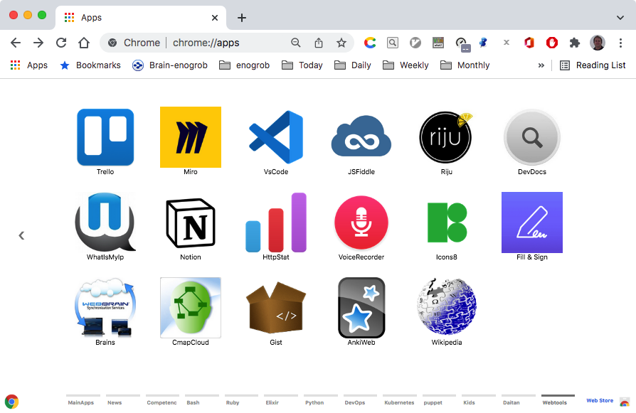

# Chrome Apps for WebTools


## Installation

### 1. Clone this repository and see its contents.
Open a terminal give the following command:

```bash
$ git clone https://github.com/enogrob/chromeapps-webtools.git
```

As we can see a subdirectory is created for each DevOps app.

```bash
$ ls -la
total 984
drwxr-xr-x@   8 enogrob  staff    272 Oct  5 14:59 .
drwxr-xr-x@ 300 enogrob  staff  10200 Oct  5 14:52 ..
-rw-r--r--@   1 enogrob  staff   6148 Oct  5 23:25 .DS_Store
-rw-r--r--@   1 enogrob  staff      6 Aug  1  2016 .gitignore
-rw-r--r--@   1 enogrob  staff      0 Nov 17  2016 Icon?
-rw-r--r--@   1 enogrob  staff    843 Oct  6 04:12 README.md
drwxr-xr-x   11 enogrob  staff    374 Oct  6 04:10 apps
drwxr-xr-x    4 enogrob  staff    136 Oct  4 11:11 images

$ tree -L 1 apps/
apps
├── Webtools-4Devs
├── Webtools-Applicationize
├── Webtools-ChromeImages
├── Webtools-DevDocs
├── Webtools-FontAwesome
├── Webtools-IconArchive
├── Webtools-MAPAcep
├── Webtools-Miro
└── Webtools-Trello

16 directories, 0 files
```

### 2. Open Chrome with the following url:
In order to load the `Chrome Apps` for Eicon, check `Developer Mode` and press `Load unpacked extension...` to load each App selecting its corresponding directory inside `apps` e.g. `WebTools-Miro`, and then repeat that for the wanted apps.

```
chrome://extensions/
```

### 3. After load the Chrome Apps wanted for WebTools, Chrome will look like the screenshot below:

